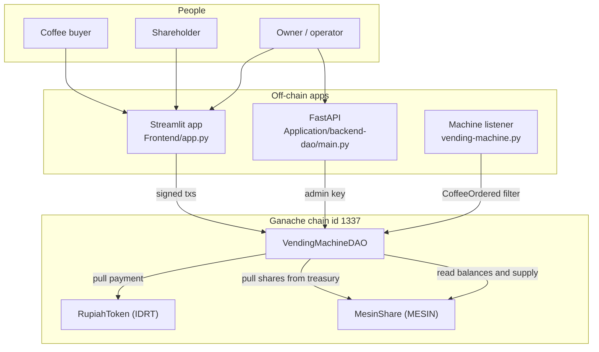
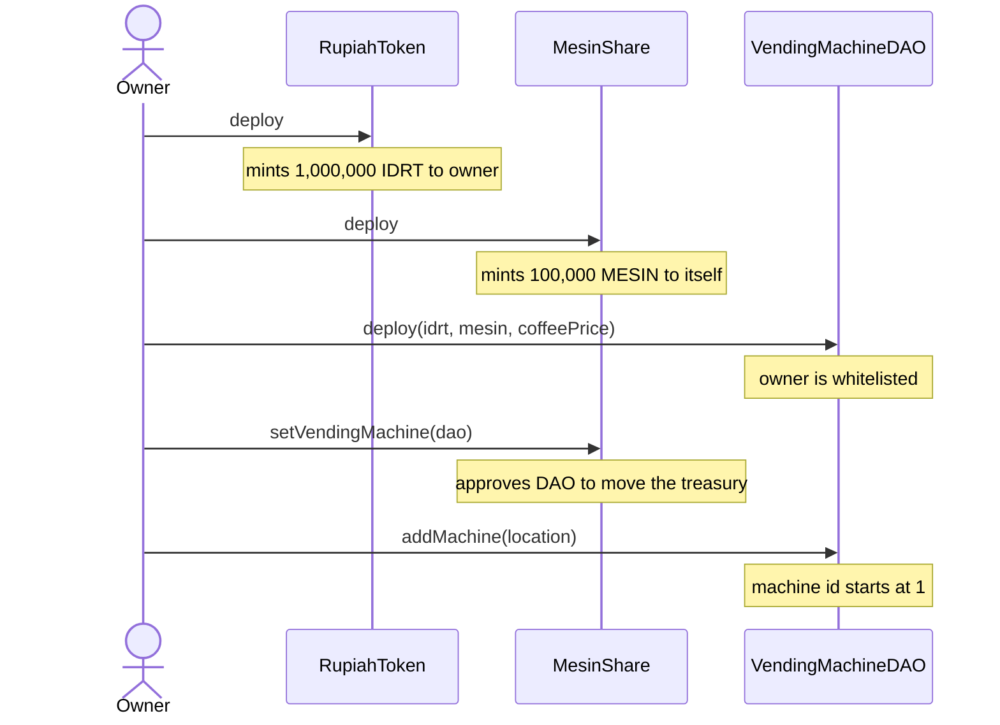
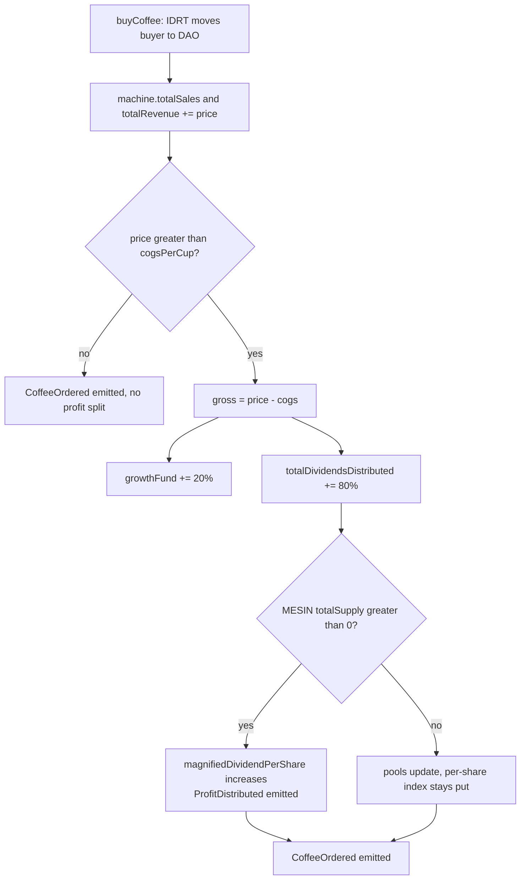
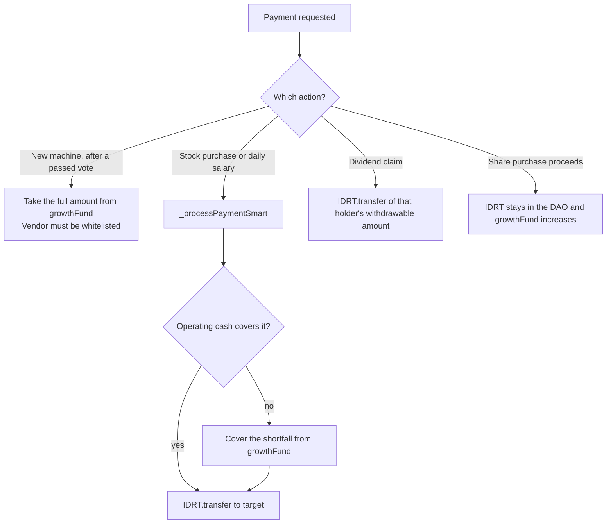
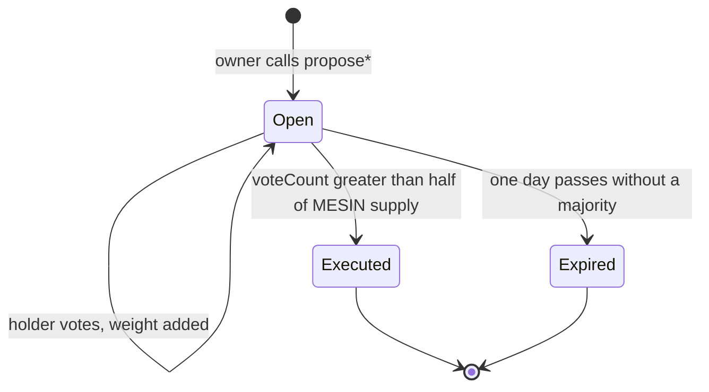
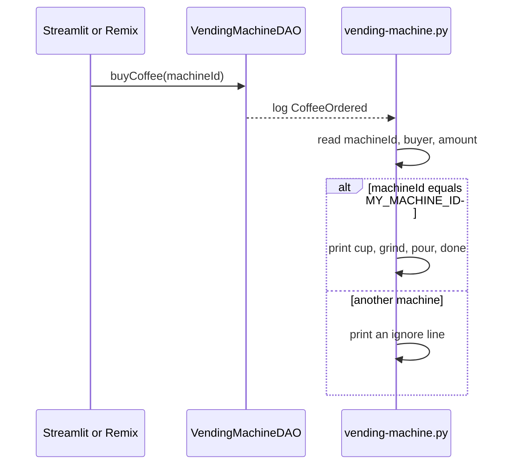

# Decentralized IoT Vending Machine (RWA Tokenization)

A local Ethereum demo that tokenizes a coffee vending fleet as a real-world asset. Customers pay in an on-chain rupiah token. Each sale splits profit between shareholders and a growth fund. A Python process standing in for the machine dispenses a cup only after it sees a `CoffeeOrdered` event for its own machine id. Shareholders vote on vendors, stock purchases, new machines, and daily salaries. The owner cannot send operating cash to an arbitrary wallet.

This repository is a course project. It is meant to run against Ganache (chain id `1337`), not a public network.

## Contents

- [Why this exists](#why-this-exists)
- [How the pieces fit](#how-the-pieces-fit)
- [Repository layout](#repository-layout)
- [Tech stack](#tech-stack)
- [Smart contracts](#smart-contracts)
- [Money flow](#money-flow)
- [Shareholders and dividends](#shareholders-and-dividends)
- [DAO governance](#dao-governance)
- [IoT listener](#iot-listener)
- [Streamlit app](#streamlit-app)
- [HTTP API](#http-api)
- [Run it locally](#run-it-locally)
- [Demo script](#demo-script)
- [What to expect](#what-to-expect)
- [Configuration](#configuration)
- [Contract reference](#contract-reference)
- [Design notes](#design-notes)

## Why this exists

In a normal vending business, investors see sales only through reports the operator writes. Those reports can be edited after the fact. Here the machine does not trust a button, a spreadsheet, or the operator:

1. Payment is an ERC-20 transfer into `VendingMachineDAO`.
2. The contract emits `CoffeeOrdered` with a machine id, buyer, and amount.
3. `vending-machine.py` dispenses only when that event names its machine.
4. Gross profit is split in the same transaction: 80% to a dividend pool, 20% to a growth fund.
5. Cash leaves the contract for salaries, stock, and new machines only through rules shareholders have already approved, and only to whitelisted addresses.

## How the pieces fit



Three roles share one contract:

| Role | What they do | Where |
| --- | --- | --- |
| Buyer | Approve IDRT, call `buyCoffee(machineId)` | Streamlit “Simulasi Beli”, or Remix |
| Shareholder | Buy MESIN, claim dividends, vote, transfer shares | Streamlit “Investor Panel” |
| Owner | Register machines, set price and COGS, pay daily salary, create proposals | Streamlit “Admin Panel”, or the FastAPI admin routes |

The listener never sends a transaction. It only watches logs.

## Repository layout

```text
vending-machine-rwa/
├── VendingMachine.sol          # VendingMachineDAO: sales, dividends, proposals
├── RupiahToken.sol             # IDRT payment token and test faucet
├── MesinShare.sol              # MESIN share token; treasury lives on the token
├── vending-machine.py          # IoT stand-in; listens for CoffeeOrdered
├── requirements.txt            # web3, for the listener
├── Frontend/
│   ├── app.py                  # Streamlit dashboard, investor, admin, buy flow
│   └── abi.json                # ABI the UI loads (must match the deployment)
└── Application/backend-dao/
    ├── main.py                 # FastAPI read API plus admin/demo writes
    ├── abi.json                # ABI the API loads
    └── requirements.txt        # fastapi, uvicorn, web3, python-dotenv, pydantic
```

`VendingMachine.sol` declares `contract VendingMachineDAO`. Older notes in this repo mention `VendingMachineNative.sol`, `VendingMachineFleet.sol`, and `machine_controller.py`. Those names are not in the tree. The listener file is `vending-machine.py`.

## Tech stack

| Layer | Choice |
| --- | --- |
| Contracts | Solidity `^0.8.20`. The DAO embeds a minimal `IERC20` and imports nothing. The two tokens import OpenZeppelin `ERC20` and `Ownable`. |
| Chain | Ganache, chain id **1337**, typically `http://127.0.0.1:7545` |
| Machine | Python 3 and `web3.py`. Polls `CoffeeOrdered` once a second. |
| UI | Streamlit, pandas, python-dotenv, web3.py |
| API | FastAPI, uvicorn, pydantic |
| Compiler UI | Remix IDE, with the OpenZeppelin plugin or a GitHub import for the token contracts |

All token amounts use **18 decimals**. The apps divide by `10**18` when they show rupiah or share counts, and multiply by `10**18` when they send a transaction.

## Smart contracts

Deploy in this order. Later contracts need addresses from earlier ones.



### RupiahToken (`IDRT`)

Payment token. Name `Rupiah Digital`, symbol `IDRT`.

- Constructor mints `1_000_000 * 10**18` to the deployer.
- `mint(to, amount)` is owner-only, for extra test funds.
- `mintaUangGratis()` mints `100_000 * 10**18` to the caller. The Streamlit investor page shows this faucet when the wallet holds less than 10,000 IDRT.

### MesinShare (`MESIN`)

Share token. Name `Saham Vending Machine`, symbol `MESIN`.

- Constructor mints `100_000 * 10**18` to the token contract itself. That balance is the unsold treasury. `getAvailableShares()` on the DAO reads `balanceOf(address(assetToken))`.
- `setVendingMachine(dao)` is owner-only. It stores the DAO address and calls `_approve(treasury, dao, treasuryBalance)` so `buyShares` can `transferFrom` the treasury.
- Call `setVendingMachine` again after a partial sale if you need the allowance topped up to the remaining balance. The function approves the balance at the time it is called.

### VendingMachineDAO

Constructor:

```solidity
constructor(address _paymentToken, address _assetToken, uint256 _coffeePrice)
```

| Argument | Meaning |
| --- | --- |
| `_paymentToken` | `RupiahToken` address |
| `_assetToken` | `MesinShare` address |
| `_coffeePrice` | Price of one cup in IDRT wei. `15000 * 10**18` is 15,000 IDRT. |

The deployer becomes `owner` and is added to `isWhitelisted`.

Defaults set in storage (the constructor overwrites `coffeePrice`):

| Storage | Default | Who can change it |
| --- | --- | --- |
| `coffeePrice` | `15000 * 10**18` | Owner, `setCoffeePrice` |
| `cogsPerCup` | `5000 * 10**18` | Owner, `setCogs` |
| `sharePrice` | `1000 * 10**18` | Fixed after deploy |
| `REINVEST_RATE` | 20 | Constant |
| `DIVIDEND_RATE` | 80 | Constant |
| `MAX_WALLET_PERCENT` | 40 | Constant |

State-changing calls use `noReentrancy`. Owner-only calls use `onlyOwner`.

## Money flow

One cup at the default price:

| Line | IDRT |
| --- | --- |
| Price paid into the DAO | 15,000 |
| COGS retained as operating cash | 5,000 |
| Gross profit | 10,000 |
| Growth fund (20%) | 2,000 |
| Dividend pool (80%) | 8,000 |



COGS is not booked into its own variable. It stays in the IDRT balance. Operating cash is whatever is left after locking the growth fund and unpaid dividends:

```text
unclaimedDividends = totalDividendsDistributed - totalDividendsClaimed
lockedFunds        = growthFund + unclaimedDividends
operationalReserve = balance - lockedFunds    # 0 when balance is smaller
```

`getOperationalReserve()` returns that figure. The dashboard labels it “Kas Operasional”.

### How cash is allowed to leave



`BUY_MACHINE` spends the growth fund only. Stock purchases and salaries spend operating cash first, then the growth fund. A salary or stock payment reverts with `Modal Growth Fund Habis!` when both buckets are short. It reverts with `Kas Kosong` when the token balance itself is short. Unclaimed dividends stay locked, so a salary cannot spend money shareholders have not claimed yet.

## Shareholders and dividends

MESIN is the claim on the dividend pool. Supply is fixed at 100,000 tokens. Unsold tokens sit on the `MesinShare` contract.

### Buying shares

`buyShares(amount)`:

1. Checks the treasury still holds `amount`.
2. Checks the buyer’s balance plus `amount` is at most 40% of `totalSupply` (40,000 MESIN).
3. Pulls `amount * sharePrice / 10**18` IDRT from the buyer. One whole share costs 1,000 IDRT.
4. Pulls MESIN from the treasury to the buyer. This requires the allowance set by `setVendingMachine`.
5. Adds the IDRT proceeds to `growthFund`.
6. Writes a negative dividend correction so the new shares do not inherit dividends declared before the purchase.

The buyer must `approve` the DAO on IDRT for the exact cost first. The Streamlit investor tab does that approval when the current allowance is too small.

### Transferring shares

`transferSaham(to, amount)` enforces the same 40% cap on the recipient, then `transferFrom` the sender. The sender must approve the DAO on MESIN first. Dividend corrections move with the shares: dividends accrued while you held them stay in your claim, and the recipient starts from zero on those shares.

### Claiming

```text
accumulatable = (balance * magnifiedDividendPerShare + correction) / 2**128
withdrawable  = accumulatable - withdrawnDividends
```

`claimDividends()` pays `getWithdrawableDividend(msg.sender)` in IDRT and increases `withdrawnDividends` and `totalDividendsClaimed`.

`MAGNITUDE` is `2**128`. It keeps per-share accounting in integers when profit does not divide evenly across supply.

### Passing a vote takes two holders

Votes are weighted by MESIN balance. A proposal auto-executes when `voteCount > totalSupply / 2`, which is more than 50,000 shares. The 40% wallet cap means one holder has at most 40,000, so at least two holders must vote. Treasury tokens count in `totalSupply` and do not vote, so a proposal cannot pass until more than half of all MESIN has been sold and those holders vote yes inside the one-day window.

## DAO governance

Only the owner may create a proposal. Any MESIN holder may vote once. There is no separate execute transaction on the current contract: crossing 50% runs the effect inside `vote`.



| `ProposalType` | Value | Create function | What execution does |
| --- | --- | --- | --- |
| `BUY_MACHINE` | 0 | `proposeBuyMachine(vendor, price, desc)` | Vendor must already be whitelisted. Deducts `price` from `growthFund` and transfers IDRT. Emits `ExpensePaid("BELI MESIN", ...)`. |
| `BUY_STOCK` | 1 | `proposeBuyStock(vendor, price, desc)` | Vendor must be whitelisted. Pays with `_processPaymentSmart`. Emits `ExpensePaid("BELI BAHAN", ...)`. |
| `UPDATE_SALARY` | 2 | `proposeUpdateSalary(staff, dailyAmount, reason)` | Sets `staffSalaries[staff]`. Whitelists the staff address if needed. Does not send IDRT. |
| `ADD_VENDOR` | 3 | `proposeAddVendor(vendor, name)` | Sets `isWhitelisted[vendor] = true`. `amount` is stored as 0. |

Voting rules in `vote(id)`:

- `block.timestamp < endTime` (`endTime` is creation time plus 1 day)
- Caller has not voted on this proposal
- Proposal is not already executed
- Caller holds some MESIN
- Each call adds `assetToken.balanceOf(msg.sender)` to `voteCount`

Salary payment is a second step. After `UPDATE_SALARY` has executed, the owner calls `payDailySalary(staff)` at most once per `1 days`. The amount is read from `staffSalaries`. Payment uses the smart cash waterfall and emits `ExpensePaid("GAJI HARIAN", ...)`.

The owner can still, without a vote:

- `addMachine(location)` — ids start at 1 and increase by one
- `setCoffeePrice(price)`
- `setCogs(newCogs)`
- `payDailySalary(staff)` once a daily rate exists

`addMachine` marks the machine `isActive = true`. `buyCoffee` reverts with `Mesin Mati` when `isActive` is false. No function in this contract turns a machine off.

## IoT listener

`vending-machine.py` is the hardware stand-in. On startup it connects to `RPC_URL`, checksums `CONTRACT_ADDRESS`, and prints the machine id it controls. The main loop creates a `CoffeeOrdered` filter from the latest block and polls every second.



The dispense path sleeps one second between four hardware lines. Amounts in the log are divided by `10**18` and printed as IDRT. `Ctrl+C` stops the loop. Any other exception sleeps five seconds and keeps listening.

Edit these constants at the top of `vending-machine.py` after every deploy:

| Constant | Role |
| --- | --- |
| `MY_MACHINE_ID` | Must equal the id from `addMachine`. The first machine is `1`. |
| `RPC_URL` | Ganache HTTP endpoint. Default `http://127.0.0.1:7545`. |
| `CONTRACT_ADDRESS` | Deployed `VendingMachineDAO`. |
| `CONTRACT_ABI` | Inlined JSON. Replace it if you recompile and the `CoffeeOrdered` shape changes. |

Run a second terminal with a different `MY_MACHINE_ID` to simulate another cabinet. Each process ignores sales for the other id.

## Streamlit app

`Frontend/app.py` is a four-page local wallet. It signs transactions with a private key typed into the page. Use Ganache keys only.

| Sidebar entry | Page | What it does |
| --- | --- | --- |
| Dashboard Explorer | Public read | Five metrics: omzet, growth fund, operating cash, dividends distributed, unclaimed dividends. Event table across sales, expenses, IPO, transfers, claims, proposals, votes, executions, and profit splits. Refreshes about every 5 seconds. |
| Investor Panel | Shareholder key | Share balance, withdrawable dividend, IDRT balance. Tabs: buy shares, claim dividends, vote, transfer shares. Faucet button when IDRT is under 10,000. |
| Admin Panel | Owner key | Rejects any key whose address is not `owner()`. Tabs: add machine and set price/COGS, pay today’s salary, create a proposal, list the fleet. |
| Simulasi Beli | Buyer key | Shows `coffeePrice`, approves that exact amount, calls `buyCoffee`. |

Writes use chain id `1337`, gas limit `3_000_000`, and gas price `20 gwei`. Approvals are for the exact wei amount of that action, not unlimited allowance.

The investor buy form caps the input at `getAvailableShares()`. A purchase still checks stock and IDRT balance before sending.

The dashboard reads events from block 0, so the table grows with the chain. It needs the Ganache node that holds this deployment.

## HTTP API

`Application/backend-dao/main.py` exposes the same contract over HTTP. Read routes are public. Write routes sign with `ADMIN_PRIVATE_KEY` from the environment, so they act as the owner wallet. CORS allows every origin.

Start it from `Application/backend-dao` so `abi.json` and `.env` resolve. Interactive docs are at `http://127.0.0.1:8000/docs`.

### Reads

| Method | Path | Returns |
| --- | --- | --- |
| `GET` | `/` | Status string and contract address |
| `GET` | `/public/stats` | Revenue, growth fund, coffee price, share price, machine count, available shares, all scaled to whole tokens |
| `GET` | `/public/machines` | `id`, `location`, `is_active`, `total_sales` for ids `1..machineCount` |
| `GET` | `/public/proposals` | Proposal struct fields, with `type_name` from the enum |
| `GET` | `/investor/{address}` | Checksum address, MESIN token address, withdrawable dividend |

### Admin writes

| Method | Path | Body | Contract call |
| --- | --- | --- | --- |
| `POST` | `/admin/add-machine` | `{ "location": "Jakarta" }` | `addMachine` |
| `POST` | `/admin/create-proposal` | `{ "p_type": 0, "target": "0x...", "amount": 1000, "description": "..." }` | One of the four `propose*` functions. `amount` is a human IDRT number, converted with `10**18`. |
| `POST` | `/admin/set-price` | query `price` as a float | `setCoffeePrice` |

`p_type` values match the enum: `0` buy machine, `1` buy stock, `2` set daily salary, `3` add vendor.

### Demo writes

These exist so Swagger can drive a flow with the admin wallet. A production client would send `approve` and the business call from the user’s own wallet.

| Method | Path | Body | Contract call |
| --- | --- | --- | --- |
| `POST` | `/simulate/buy-coffee` | `{ "machine_id": 1 }` | `buyCoffee` |
| `POST` | `/simulate/vote` | `{ "proposal_id": 1 }` | `vote` |
| `POST` | `/simulate/buy-shares` | `{ "amount_shares": 1 }` | `buyShares` with `amount_shares * 10**18` |

`/simulate/buy-coffee` and `/simulate/buy-shares` still need the admin wallet to have approved IDRT (and, for shares, the treasury allowance from `setVendingMachine`). The route does not send the approval itself.

### Routes that do not match this contract

Two handlers call functions that are not in `VendingMachine.sol` or in the checked-in ABI:

| Route | Calls | What the contract actually has |
| --- | --- | --- |
| `POST /admin/execute-proposal/{id}` | `executeProposal(id)` | Execution happens inside `vote` once the majority is reached |
| `POST /admin/pay-salary` | `payMonthlySalary(staff)` | `payDailySalary(staff)` |

Calling either route returns HTTP 400. Pay salary from the Streamlit admin tab, or from Remix.

The checked-in `Frontend/abi.json` and `Application/backend-dao/abi.json` also omit `setCogs`, which does exist in `VendingMachine.sol`. The admin “Set Modal HPP” button catches that and shows that the function is missing from the loaded ABI. After you compile the current Solidity, replace both `abi.json` files (and the listener ABI if you care about new functions there) with the compiler output.

## Run it locally

### Prerequisites

- Python 3.10 or newer
- [Ganache](https://archive.trufflesuite.com/ganache/) (GUI on port `7545`, or CLI pointed at the same URL). The apps hardcode chain id `1337`.
- [Remix](https://remix.ethereum.org/) connected to that Ganache via MetaMask or Remix’s injected provider
- OpenZeppelin contracts available to Remix (`@openzeppelin/contracts/token/ERC20/ERC20.sol` and `access/Ownable.sol`) for the two tokens. The DAO file needs no import.

### 1. Start Ganache

Create or open a workspace with chain id `1337`. Note the HTTP URL and two or three funded accounts:

- Account A — deployer and owner
- Account B — shareholder
- Account C — second shareholder, or a vendor address

Copy private keys only into local `.env` files and the Streamlit password fields.

### 2. Compile and deploy

In Remix, compiler `0.8.20`:

1. Deploy `RupiahToken`. Copy its address.
2. Deploy `MesinShare`. Copy its address.
3. Deploy `VendingMachineDAO` with:
   - `_paymentToken`: RupiahToken address
   - `_assetToken`: MesinShare address
   - `_coffeePrice`: `15000000000000000000000` (15,000 with 18 decimals)
4. On `MesinShare`, call `setVendingMachine` with the DAO address.
5. On the DAO, call `addMachine` with a location string. That creates machine `1`.
6. Copy the DAO ABI from Remix. Replace `Frontend/abi.json` and `Application/backend-dao/abi.json` if they differ from this build. The listener can keep its inlined ABI as long as `CoffeeOrdered` still has `machineId`, `buyer`, and `amount`.

### 3. Point the apps at the deployment

`Frontend/.env` is gitignored. Create it next to `app.py`:

```bash
GANACHE_URL=http://127.0.0.1:7545
CONTRACT_ADDRESS=0xYourDao
PAYMENT_TOKEN_ADDRESS=0xYourIdrt
ASSET_TOKEN_ADDRESS=0xYourMesin
```

`Application/backend-dao/.env`:

```bash
RPC_URL=http://127.0.0.1:7545
CONTRACT_ADDRESS=0xYourDao
ADMIN_ADDRESS=0xOwnerAddress
ADMIN_PRIVATE_KEY=0xOwnerPrivateKey
```

In `vending-machine.py`, set `MY_MACHINE_ID = 1`, `RPC_URL`, and `CONTRACT_ADDRESS` to the same DAO.

The UI stops on startup when `CONTRACT_ADDRESS` or `PAYMENT_TOKEN_ADDRESS` is empty.

### 4. Install and start

From the repository root, three terminals:

```bash
# Terminal 1 — machine
pip install -r requirements.txt
python vending-machine.py
```

```bash
# Terminal 2 — dashboard. Run inside Frontend so abi.json and .env load.
cd Frontend
pip install streamlit pandas python-dotenv web3
streamlit run app.py
```

```bash
# Terminal 3 — optional API. Run inside backend-dao so abi.json and .env load.
cd Application/backend-dao
pip install -r requirements.txt
uvicorn main:app --reload
```

A healthy listener prints that it connected and is waiting on `CoffeeOrdered`. Streamlit opens a local URL, usually `http://localhost:8501`. The API root `GET /` returns `DAO Backend Online`.

## Demo script

Do this once the listener is running and machine `1` exists.

1. **Fund a buyer.** On the investor page, connect a Ganache key and use “Minta 100rb IDRT” if the balance is under 10,000. Or call `mintaUangGratis()` on `RupiahToken` from Remix.
2. **Buy a coffee.** Open “Simulasi Beli”, enter the buyer key and machine id `1`, then “Bayar & Tuang Kopi”. The UI approves IDRT and calls `buyCoffee`. The listener should print the four hardware steps for machine 1. The dashboard should show omzet `15000`, growth fund `2000`, dividends `8000`, and operating cash `5000` after the first cup at default prices.
3. **Sell shares to two wallets.** Each buyer approves IDRT, then buys MESIN. Keep each wallet at or under 40,000 shares. To pass any later vote, the yes votes together need more than 50,000 shares, so sell at least that many across the two wallets.
4. **Claim.** After at least one profitable sale, “Klaim Dividen” pays that wallet’s share of the 80% pool.
5. **Whitelist a vendor.** Admin creates proposal type `3` aimed at the vendor address. Both shareholders vote. The second vote that crosses 50% of supply whitelists the vendor in the same transaction.
6. **Restock or buy a machine.** Create type `1` (stock, paid from operating cash then growth fund) or type `0` (new machine, paid from the growth fund only). The vendor must already be whitelisted. Vote the same way.
7. **Set a daily salary, then pay it.** Proposal type `2` stores the daily IDRT amount and whitelists the staff address. It does not move IDRT. The admin then uses “Bayar Gaji Hari Ini”. A second payment the same day reverts with `Hari ini sudah gajian!`.

Share purchases add their IDRT cost to the growth fund, which is the bucket a `BUY_MACHINE` proposal spends.

## What to expect

| Case | Action | Result |
| --- | --- | --- |
| Normal sale | `buyCoffee` on an active machine, IDRT approved | `CoffeeOrdered`. Listener for that id dispenses. Profit splits 80/20 when price is above COGS. |
| Wrong machine | Listener `MY_MACHINE_ID` differs from the sale | That process logs an ignore line. The matching process dispenses. |
| Dead machine | `buyCoffee` when `isActive` is false | Revert `Mesin Mati`. No event, no cup. |
| Unapproved IDRT | `buyCoffee` or `buyShares` without allowance | Revert `Gagal Bayar` or the token’s allowance error. |
| Sold-out IPO | `buyShares` above treasury balance | Revert `Sold Out`. |
| Whale | Buy or receive shares that would exceed 40% of supply | Revert `Max Wallet Limit 40%`. |
| Claim with nothing due | `claimDividends` | Revert `Nihil`. |
| Vote with no shares | `vote` | Revert `No Token`. |
| Second vote | Same wallet, same proposal | Revert `Sudah Vote`. |
| Late vote | After `endTime` | Revert `Waktu Habis`. The proposal stays unexecuted. |
| Salary before a vote | `payDailySalary` for an unset staff | Revert `Gaji harian belum diset via Proposal!`. |
| Salary twice in a day | `payDailySalary` inside the cooldown | Revert `Hari ini sudah gajian!`. |
| Stock or machine paid to a stranger | Proposal target not whitelisted | Execution reverts `Vendor Ilegal`. Because execution is inside `vote`, that vote reverts too. |
| Machine purchase larger than the growth fund | Passed `BUY_MACHINE` | Revert `Dana Growth Kurang`. |
| Payment larger than cash and growth fund | Salary or stock | Revert `Modal Growth Fund Habis!` or `Kas Kosong`. |

## Configuration

| File | Keys |
| --- | --- |
| `Frontend/.env` | `GANACHE_URL`, `CONTRACT_ADDRESS`, `PAYMENT_TOKEN_ADDRESS`, `ASSET_TOKEN_ADDRESS` |
| `Application/backend-dao/.env` | `RPC_URL`, `CONTRACT_ADDRESS`, `ADMIN_ADDRESS`, `ADMIN_PRIVATE_KEY` |
| `vending-machine.py` | `MY_MACHINE_ID`, `RPC_URL`, `CONTRACT_ADDRESS`, `CONTRACT_ABI` |

Chain id `1337` is hardcoded in `Frontend/app.py` (`send_transaction`) and in `Application/backend-dao/main.py` (`send_admin_tx`). A node on another chain id will reject those raw transactions. Change the node, or the apps, so they match. This README does not change those files.

`.gitignore` ignores `Frontend/.env`, Python caches, `.deps/`, and `artifacts/`. It does not ignore `Application/backend-dao/.env`. Keep private keys out of git.

## Contract reference

### Machines

`machines(id)` returns `(id, location, isActive, totalSales)`. Ids are `1` through `machineCount`. `totalSales` is the sum of coffee prices paid to that machine, in IDRT wei.

### Events the dashboard indexes

| Event | When |
| --- | --- |
| `CoffeeOrdered(machineId, buyer, amount)` | Every successful cup. `machineId` is indexed. |
| `ProfitDistributed(dividendAmount, growthAmount)` | A cup had profit and MESIN supply was non-zero. |
| `ExpensePaid(category, to, amount, note)` | Machine purchase, stock purchase, or daily salary. |
| `SharesPurchased(investor, amount, cost)` | IPO buy. |
| `ShareTransferred(from, to, amount)` | `transferSaham`. |
| `DividendClaimed(investor, amount)` | Claim. |
| `ProposalCreated(id, pType, desc)` | Owner opened a proposal. `pType` is a string such as `BELI MESIN`. |
| `Voted(proposalId, voter, weight)` | A ballot was counted. |
| `ProposalExecuted(id, success)` | Auto-execution finished. `success` is always `true` on this path. |

### View helpers

| Function | Use |
| --- | --- |
| `getWithdrawableDividend(holder)` | IDRT wei that holder can claim |
| `getOperationalReserve()` | IDRT wei not locked in growth fund or unpaid dividends |
| `getAvailableShares()` | MESIN wei still on the token contract |
| `staffSalaries(staff)` | Daily rate in IDRT wei, `0` if unset |
| `lastPaid(staff)` | Timestamp of the last salary payment |
| `isWhitelisted(account)` | Vendor or staff allowed to receive operating payments |
| `proposals(id)` | `(id, pType, target, amount, description, voteCount, executed, endTime)` |

## Design notes

- The machine trusts the log, not the operator. Stopping `vending-machine.py` does not stop sales or dividend accounting. It only stops the simulated dispense. Restarting it filters from the latest block, so cups sold while it was down are not replayed.
- Dividend math follows the usual magnified-per-share pattern. Corrections on buy and transfer keep old profit with the holders who were in the pool at the time, and give new shares a zero starting claim.
- The owner sets price and COGS directly. A higher price or a lower COGS changes the next cup’s profit split with no vote.
- `BUY_MACHINE` does not call `addMachine`. Paying a vendor and registering a cabinet are separate steps. The owner registers a machine with `addMachine` whenever they want.
- OpenZeppelin on the tokens and a hand-written `IERC20` on the DAO are enough for `transfer`, `transferFrom`, `balanceOf`, and `totalSupply`. The DAO never calls `approve`; callers approve it.
- `mintaUangGratis` can inflate IDRT without limit. That is a test faucet. It is not a peg to the rupiah.
- Streamlit and the API hold raw private keys so the demo can sign without MetaMask. Those keys are Ganache keys. Do not reuse them anywhere else, and do not point `RPC_URL` at a public chain.
- Contract sources carry `SPDX-License-Identifier: MIT`.
