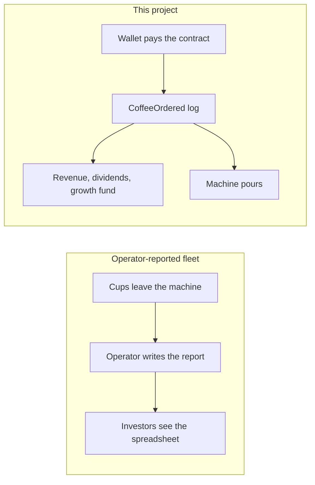
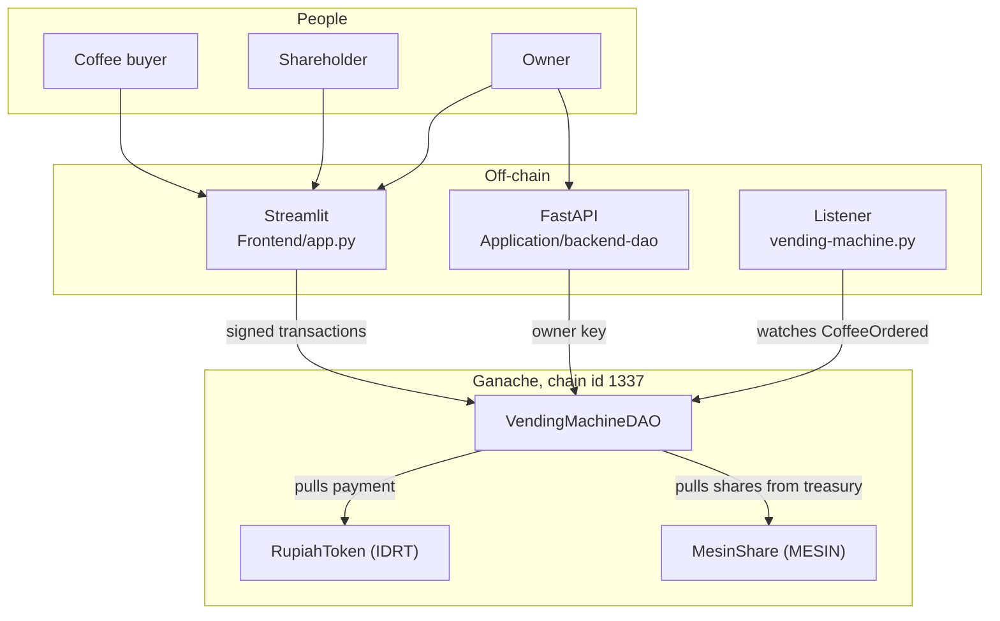
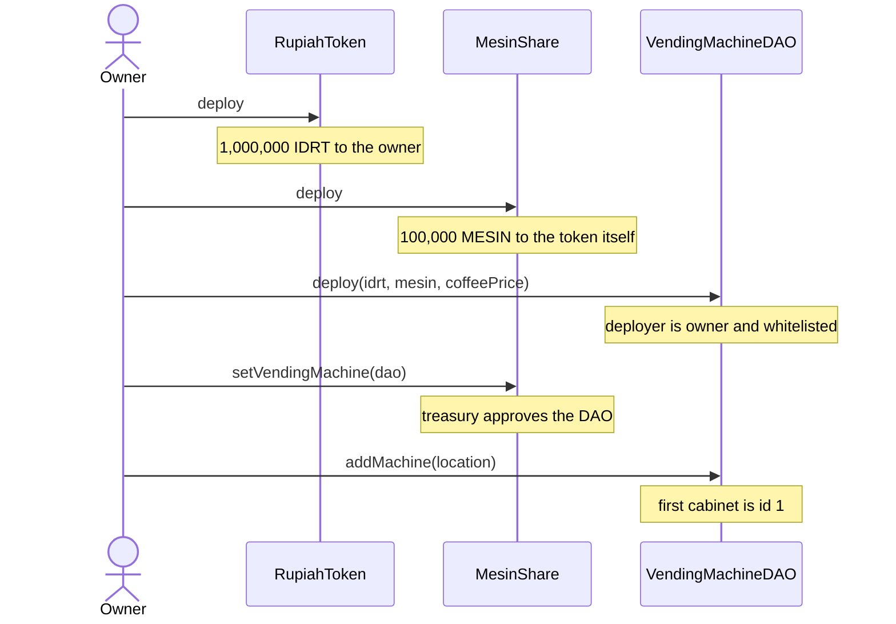
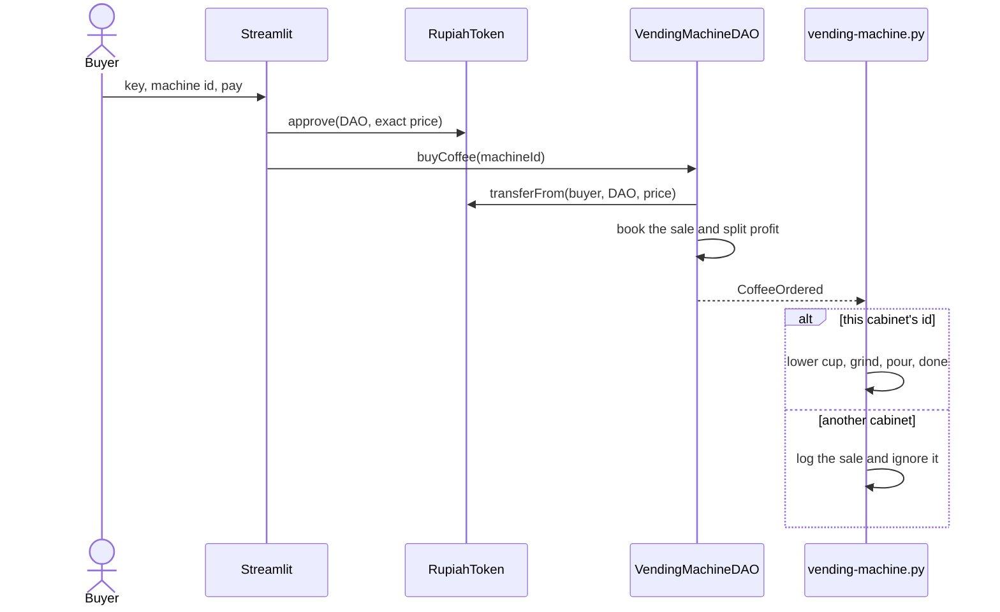
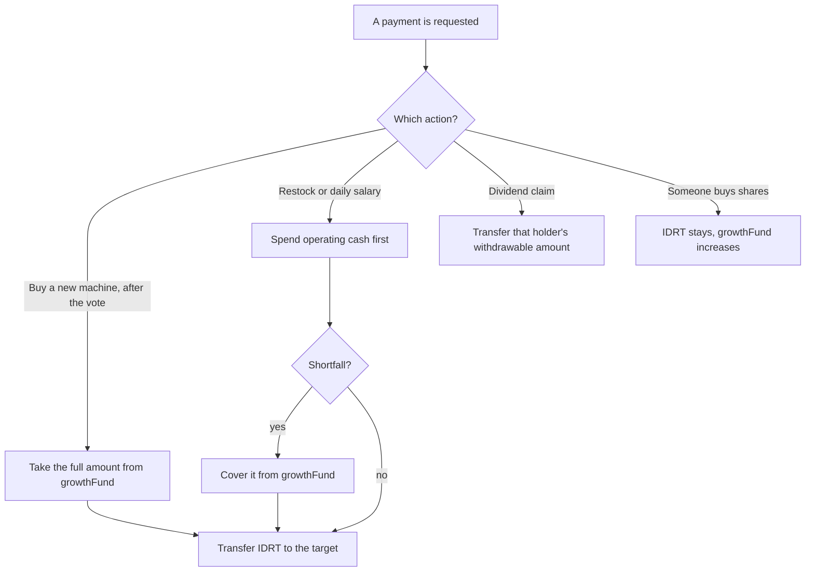
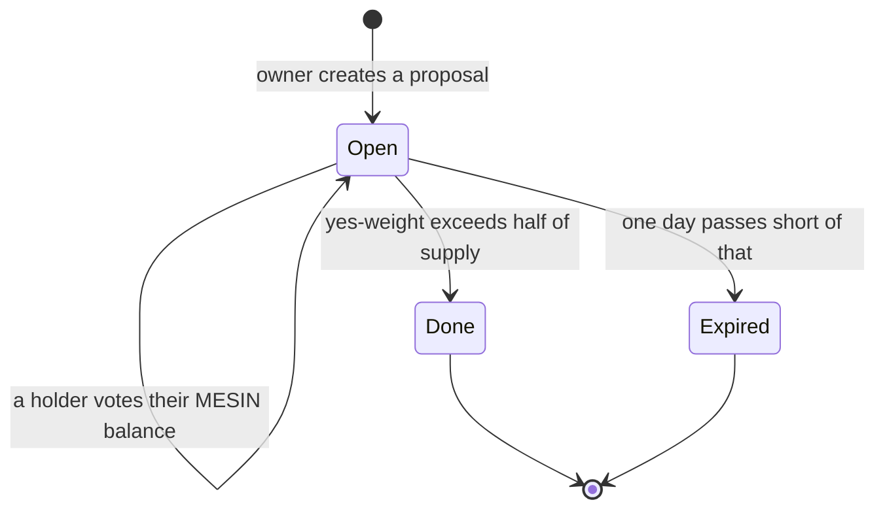

# Decentralized IoT Vending Machine (RWA Tokenization)

A course project that turns a coffee vending fleet into an on-chain real-world asset. Customers pay in a rupiah token. Shareholders hold a share token and receive profit from each cup. A Python process standing in for the machine pours only after the blockchain says the cup was paid for.

It runs on a local Ganache chain (chain id `1337`). The keys in the UI and the API are demo keys. Keep them off any public network.

## Why this exists

A vending fleet is a cash business spread across many sites. Someone restocks the beans, empties the coin box, pays the staff, and later tells the investors how many cups were sold. The investors never saw the cups. They saw a report written by the same person who handles the cash.

That report can be wrong in two directions. Cups can disappear from the books and the cash can leave with them. Cups can also be added to the books so the business looks healthier than it is. The second failure is the one this project takes as its lesson. Luckin Coffee, a large coffee chain, reported sales that were later shown to be fabricated. Investors had been pricing a business whose transaction record was written by the company itself. A vending operator with a spreadsheet has the same kind of power on a smaller scale: the number of cups is whatever they type.

This project answers that with a narrower rule. The machine has no "I sold a coffee" button. A cup exists in the books only when a customer’s wallet pays the smart contract, and the hardware pours only when it sees that payment as a log. The operator can still run the fleet. They cannot silently rewrite yesterday’s sales, and they cannot send the treasury to a personal wallet.

The fleet itself is the asset being tokenized. `MesinShare` (symbol `MESIN`, "Saham Vending Machine") is the share. `RupiahToken` (symbol `IDRT`, "Rupiah Digital") is the money customers and investors move. `VendingMachineDAO` is the company: it holds the cash, splits each sale, and lets shareholders approve who may be paid.



What that buys, in this demo:

1. **The pour follows the log.** `vending-machine.py` dispenses only for a `CoffeeOrdered` event whose machine id matches that cabinet.
2. **Profit is split in the same transaction.** 80% of gross profit is credited to whoever holds MESIN. 20% goes to a growth fund.
3. **Cash leaves through rules.** Salaries, stock, and new machines are paid to whitelisted addresses. Shareholders vote those rules in. A passed vote runs immediately. There is no second "owner executes and maybe changes the recipient" step.

The UI is in Indonesian because the scenario is a local fleet paid in digital rupiah. The contract error strings are Indonesian too (`Mesin Mati`, `Hari ini sudah gajian!`, `Vendor Ilegal`).

## Who uses it

| Role | What they care about | Where they act |
| --- | --- | --- |
| Buyer | Pay for one cup at one machine | Streamlit “Simulasi Beli”, or Remix |
| Shareholder | Own MESIN, claim dividends, vote, transfer shares | Streamlit “Investor Panel” |
| Owner | Register cabinets, set price and COGS, propose spends, click the daily salary | Streamlit “Admin Panel”, or the FastAPI admin routes |
| Cabinet | Pour when its own id appears in a log | `vending-machine.py` |

The listener never sends a transaction. Stopping it stops the simulated pour. It does not stop the accounting.

## How the pieces fit



```text
VendingMachine.sol          contract VendingMachineDAO
RupiahToken.sol             IDRT, with a test faucet
MesinShare.sol              MESIN, minted to the token itself
vending-machine.py          one cabinet; ABI inlined
requirements.txt            web3, for the listener
Frontend/app.py             Streamlit dashboard, investor, admin, buy flow
Frontend/abi.json           ABI the UI loads
Application/backend-dao/    FastAPI service, its own abi.json and requirements.txt
```

Older notes mention `VendingMachineNative.sol`, `VendingMachineFleet.sol`, and `machine_controller.py`. Those files are not in this tree. The listener is `vending-machine.py`. The DAO source file is `VendingMachine.sol`.

| Layer | Choice |
| --- | --- |
| Contracts | Solidity `^0.8.20`. The DAO embeds a small `IERC20` and imports nothing, so the business logic is readable in one file. The two tokens import OpenZeppelin `ERC20` and `Ownable`. |
| Chain | Ganache, chain id **1337**, usually `http://127.0.0.1:7545` |
| Cabinet | Python 3 and web3.py, polling once a second |
| UI | Streamlit, pandas, python-dotenv, web3.py |
| API | FastAPI, uvicorn, pydantic |
| Compiler | Remix, with OpenZeppelin available for the token imports |

Every token amount uses **18 decimals**. The apps divide by `10**18` for display and multiply by `10**18` when they send a transaction.

## The three contracts

Deploy top to bottom. Share sales revert until the treasury has approved the DAO.



### RupiahToken, the money

Name `Rupiah Digital`, symbol `IDRT`. The constructor mints `1_000_000 * 10**18` to the deployer. `mint(to, amount)` is owner-only, for extra test funds. `mintaUangGratis()` mints `100_000 * 10**18` to whoever calls it, so a classmate can get a wallet balance without passing keys around. The investor page shows that faucet when the connected wallet holds less than 10,000 IDRT.

This faucet can inflate IDRT without limit. It is there so the demo can be played. It is not a peg to the rupiah.

### MesinShare, the company stock

Name `Saham Vending Machine`, symbol `MESIN`. Supply is fixed at `100_000 * 10**18`, and the constructor mints all of it to the token contract. That balance is the unsold shelf. `getAvailableShares()` on the DAO reads `balanceOf` of the token’s own address.

`setVendingMachine(dao)` is owner-only. It stores the DAO and approves it to move whatever MESIN is still on the token. `buyShares` then `transferFrom`s the treasury to the investor. If you call this before the DAO exists, there is nothing to approve. If a later change leaves the allowance short, call `setVendingMachine` again. It approves the balance at that moment.

### VendingMachineDAO, the company

```solidity
constructor(address _paymentToken, address _assetToken, uint256 _coffeePrice)
```

`_coffeePrice` is wei. `15000000000000000000000` is 15,000 IDRT. The constructor overwrites the default price with this argument. The deployer becomes `owner` and is added to `isWhitelisted`, so the owner can be paid during testing without a vendor vote.

| Storage | Starting value | Who can change it |
| --- | --- | --- |
| `coffeePrice` | 15,000 IDRT | Owner, `setCoffeePrice` |
| `cogsPerCup` | 5,000 IDRT | Owner, `setCogs` |
| `sharePrice` | 1,000 IDRT per whole share | Fixed after deploy |
| `REINVEST_RATE` / `DIVIDEND_RATE` | 20 / 80 | Constants |
| `MAX_WALLET_PERCENT` | 40 | Constant |

State-changing business calls use `noReentrancy`. Owner calls use `onlyOwner`.

`addMachine(location)` appends a cabinet. Ids start at 1. Each machine stores `location`, `isActive`, and `totalSales`. New machines are active. `buyCoffee` reverts with `Mesin Mati` when `isActive` is false. This contract has no function that turns a machine off, so in normal use every registered cabinet can sell.

## What happens when someone buys a coffee



`buyCoffee` requires an active machine and an IDRT allowance. It adds the full price to that machine’s `totalSales` and to `totalRevenue`.

Gross profit is `price - cogsPerCup` when the price is higher, and zero otherwise. Of that profit, 20% is added to `growthFund` and 80% is added to `totalDividendsDistributed`. If MESIN supply is above zero, the 80% is spread across the magnified per-share index and `ProfitDistributed` is emitted. `CoffeeOrdered` is emitted either way. A normal deploy always has supply, because MesinShare mints 100,000 tokens in its constructor.

COGS is not stored in its own bucket. It simply remains in the IDRT balance. Operating cash is whatever is left after locking the growth fund and dividends nobody has claimed yet:

```text
unclaimed   = totalDividendsDistributed - totalDividendsClaimed
locked      = growthFund + unclaimed
operational = balance - locked          # zero when the balance is smaller
```

`getOperationalReserve()` is that number. The dashboard calls it “Kas Operasional”.

### One cup, in rupiah

| Line | IDRT |
| --- | --- |
| Customer pays | 15,000 |
| COGS, left as operating cash | 5,000 |
| Gross profit | 10,000 |
| Growth fund, 20% | 2,000 |
| Dividend pool, 80% | 8,000 |

After one cup and no other activity, the dashboard should read omzet 15,000, growth fund 2,000, dividends 8,000, unclaimed dividends 8,000, operating cash 5,000.

### Where cash is allowed to go



A new machine is paid only from the growth fund, and only to a whitelisted vendor. Stock and salaries use operating cash first, then the growth fund. Unclaimed dividends stay locked, so a salary cannot spend money shareholders have not taken yet. If the token balance itself is too small, the call reverts with `Kas Kosong`. If the growth fund cannot cover the rest, it reverts with `Modal Growth Fund Habis!`.

Share-sale proceeds are capital, not trading profit. They increase `growthFund` and can later pay for another cabinet.

## Shareholders

MESIN is the claim on the dividend pool. Unsold tokens sit on the MesinShare contract and do not vote.

**Buying.** `buyShares(amount)` checks the treasury, checks the 40% wallet cap, pulls `amount * sharePrice / 10**18` IDRT from the buyer, and pulls MESIN from the treasury. One whole token costs 1,000 IDRT. The buyer approves IDRT to the DAO first. The Streamlit tab sends that approval for the exact cost when the allowance is short. A negative dividend correction is written so the new shares do not collect profit declared before the purchase.

**Transferring.** `transferSaham(to, amount)` applies the same 40% cap to the recipient. The sender must approve MESIN to the DAO. Corrections move with the shares: dividends you earned while you held them stay in your claim, and the recipient starts at zero on those shares.

**Claiming.** For a holder:

```text
accumulatable = (balance * magnifiedDividendPerShare + correction) / 2**128
withdrawable  = accumulatable - already withdrawn
```

`claimDividends()` pays that amount and updates `withdrawnDividends` and `totalDividendsClaimed`. The magnitude `2**128` keeps the per-share math in integers when profit does not divide evenly. `getWithdrawableDividend(holder)` is the same figure the investor page shows as “Dividen Siap Cair”.

**Why two holders are required.** A wallet may hold at most 40% of total supply, which is 40,000 MESIN. A proposal passes when yes-votes exceed half of total supply, which is more than 50,000. One holder cannot do that. Treasury tokens count in the supply and cannot vote, so the proposal also cannot pass until more than half of all MESIN has actually been sold. Plan the demo around that: distribute shares to at least two wallets before you expect a vote to do anything.

## Governance

The owner proposes. Holders vote. Crossing 50% runs the effect inside that same `vote` transaction. There is no later execute button on this contract. If the day ends first, the proposal sits there unexecuted.



Each address votes once, must hold some MESIN, and must vote before `endTime` (creation plus one day). Weight is the voter’s MESIN balance at that moment.

| Type | Create | What a passing vote does |
| --- | --- | --- |
| 0 Buy a machine | `proposeBuyMachine(vendor, price, desc)` | Vendor must already be whitelisted. Deduct `price` from `growthFund` and send IDRT. Emits `ExpensePaid` with category `BELI MESIN`. Does not register a cabinet. The owner still calls `addMachine` for that. |
| 1 Buy stock | `proposeBuyStock(vendor, price, desc)` | Vendor must be whitelisted. Pays through the operating-cash waterfall. Category `BELI BAHAN`. |
| 2 Set a daily salary | `proposeUpdateSalary(staff, dailyAmount, reason)` | Stores `staffSalaries[staff]` and whitelists them. No IDRT moves yet. |
| 3 Add a vendor | `proposeAddVendor(vendor, name)` | Sets `isWhitelisted[vendor]`. The amount is stored as 0. |

Salary is a second click on purpose. The vote decides the daily rate. Each morning the owner calls `payDailySalary(staff)`, which reads that rate, requires `block.timestamp >= lastPaid + 1 days`, pays through the waterfall, and emits `ExpensePaid` with category `GAJI HARIAN`. A second click the same day reverts with `Hari ini sudah gajian!`. A staff address with no voted rate reverts with `Gaji harian belum diset via Proposal!`.

The owner can still, without a vote, register a machine, change the cup price, change COGS, and pay a salary whose rate was already voted. Price and COGS change the next cup’s profit split immediately. That is an operator lever this version leaves outside the vote.

If the target of a machine or stock proposal is not whitelisted, execution reverts with `Vendor Ilegal`. Because execution is inside `vote`, that ballot reverts too. Whitelist the vendor with a type 3 proposal first.

## The cabinet

`vending-machine.py` is the hardware. On startup it connects to `RPC_URL`, checksums `CONTRACT_ADDRESS`, and prints the id it controls. The loop filters `CoffeeOrdered` from the latest block.

For a matching id it prints the buyer, the IDRT amount (`wei / 10**18`), and four steps with a one-second pause: lower the cup, grind, pour, done. Any other id is logged and ignored, so two terminals can be two cabinets. `Ctrl+C` stops the loop. Any other error sleeps five seconds and keeps listening.

Set these after every deploy:

| Constant | Meaning |
| --- | --- |
| `MY_MACHINE_ID` | Must match `addMachine`. The first call creates id `1`. |
| `RPC_URL` | Default `http://127.0.0.1:7545`. |
| `CONTRACT_ADDRESS` | The deployed DAO. |
| `CONTRACT_ABI` | Inlined. Replace it if a recompile changes `CoffeeOrdered`. The listener only needs `machineId`, `buyer`, and `amount`. |

Accounting does not depend on this process. A cup sold while the script is stopped is still in `totalRevenue` and in the dividend index. Restarting the script starts at the latest block, so it will not pour those missed cups.

## The Streamlit app

`Frontend/app.py` is the local wallet. It signs with a private key typed into the page. Use a Ganache key.

Run it from `Frontend/` so `abi.json` and `.env` resolve. It refuses to start when `CONTRACT_ADDRESS` or `PAYMENT_TOKEN_ADDRESS` is empty.

| Page | What you see |
| --- | --- |
| Dashboard Explorer | Five figures: omzet, growth fund, operating cash, dividends distributed, unclaimed dividends. A table of sales, expenses, share purchases, transfers, claims, proposals, votes, executions, and profit splits, newest block first. Refreshes about every 5 seconds. |
| Investor Panel | Share count, withdrawable dividend, IDRT balance. Tabs for the IPO, claiming, voting on open proposals, and peer-to-peer transfers. Faucet when IDRT is under 10,000. |
| Admin Panel | Rejects any key that is not `owner()`. Tabs for a new machine plus price and COGS, today’s salary, a new proposal, and the fleet table. |
| Simulasi Beli | Shows `coffeePrice`, approves that exact amount, calls `buyCoffee`. |

Writes use chain id `1337`, gas limit `3_000_000`, and gas price `20 gwei`. Approvals are for the exact wei of that action.

The IPO form caps the input at `getAvailableShares()` and still checks stock and IDRT balance before sending. The fleet table lists id, location, and sales. The salary form reads `staffSalaries` first and turns the “already paid today” revert into a warning instead of a raw error.

The dashboard reads logs from block 0, so it wants the same Ganache workspace that holds this deployment.

## The HTTP API

`Application/backend-dao/main.py` is the same contract over HTTP, for Swagger or another client. Read routes are public. Write routes sign with `ADMIN_PRIVATE_KEY`, so they act as the owner. CORS allows every origin. Start it from `Application/backend-dao` so `abi.json` and `.env` load. Docs are at `http://127.0.0.1:8000/docs`.

| Method | Path | Body | What it calls |
| --- | --- | --- | --- |
| `GET` | `/` | | Status and contract address |
| `GET` | `/public/stats` | | Revenue, growth fund, coffee price, share price, machine count, shares still for sale |
| `GET` | `/public/machines` | | Id, location, active flag, sales for ids `1..machineCount` |
| `GET` | `/public/proposals` | | Each proposal, including a type name |
| `GET` | `/investor/{address}` | | MESIN token address and withdrawable dividend |
| `POST` | `/admin/add-machine` | `{ "location": "Jakarta" }` | `addMachine` |
| `POST` | `/admin/create-proposal` | `{ "p_type": 0, "target": "0x...", "amount": 1000, "description": "..." }` | One of the four `propose*` functions. `amount` is a human IDRT number. `p_type` is 0–3. |
| `POST` | `/admin/set-price` | query `price` | `setCoffeePrice` |
| `POST` | `/simulate/buy-coffee` | `{ "machine_id": 1 }` | `buyCoffee` as the admin wallet |
| `POST` | `/simulate/vote` | `{ "proposal_id": 1 }` | `vote` as the admin wallet |
| `POST` | `/simulate/buy-shares` | `{ "amount_shares": 1 }` | `buyShares` as the admin wallet |

The simulate routes exist so the demo can be driven from Swagger. They do not send the IDRT `approve`. A real client would approve and then call the DAO from the user’s own wallet.

Two handlers name functions this contract does not have:

| Route | It calls | What to use instead |
| --- | --- | --- |
| `POST /admin/execute-proposal/{id}` | `executeProposal` | Nothing. `vote` executes on its own once the majority is reached. |
| `POST /admin/pay-salary` | `payMonthlySalary` | `payDailySalary`, from the Streamlit admin tab or from Remix. |

Both return HTTP 400 against the current Solidity.

`setCogs` is in `VendingMachine.sol` and is missing from the checked-in `Frontend/abi.json` and `Application/backend-dao/abi.json`. The admin button catches that and says the function is not on the loaded ABI. After you compile the current source, replace both ABI files. The listener can keep its inlined ABI as long as `CoffeeOrdered` still has the same three fields.

## Run it

You need Python 3.10 or newer, [Ganache](https://archive.trufflesuite.com/ganache/) with chain id `1337`, and [Remix](https://remix.ethereum.org/) pointed at that node. The token files need `@openzeppelin/contracts/token/ERC20/ERC20.sol` and `access/Ownable.sol`. The DAO file needs no import. Use compiler `0.8.20`.

Create a Ganache workspace and pick three funded accounts: the deployer and owner, a shareholder, and a second shareholder or a vendor. The apps hardcode chain id `1337`. A node on another id will reject their raw transactions.

In Remix:

1. Deploy `RupiahToken`. Copy the address.
2. Deploy `MesinShare`. Copy the address.
3. Deploy `VendingMachineDAO` with the IDRT address, the MESIN address, and `15000000000000000000000`.
4. On MesinShare, call `setVendingMachine` with the DAO address.
5. On the DAO, call `addMachine` with a location. That creates machine `1`.
6. If this build’s ABI differs from the files in the repo, replace `Frontend/abi.json` and `Application/backend-dao/abi.json`.

`Frontend/.env` is gitignored. Create it next to `app.py`:

```bash
GANACHE_URL=http://127.0.0.1:7545
CONTRACT_ADDRESS=0xYourDao
PAYMENT_TOKEN_ADDRESS=0xYourIdrt
ASSET_TOKEN_ADDRESS=0xYourMesin
```

`Application/backend-dao/.env` is not gitignored. Do not commit the key.

```bash
RPC_URL=http://127.0.0.1:7545
CONTRACT_ADDRESS=0xYourDao
ADMIN_ADDRESS=0xOwnerAddress
ADMIN_PRIVATE_KEY=0xOwnerPrivateKey
```

In `vending-machine.py`, set `MY_MACHINE_ID`, `RPC_URL`, and `CONTRACT_ADDRESS` to the same deployment.

Three terminals, each from the directory that holds its config:

```bash
pip install -r requirements.txt
python vending-machine.py
```

```bash
cd Frontend
pip install streamlit pandas python-dotenv web3
streamlit run app.py
```

```bash
cd Application/backend-dao
pip install -r requirements.txt
uvicorn main:app --reload
```

The listener should say it is connected and waiting on `CoffeeOrdered`. Streamlit usually opens `http://localhost:8501`. `GET /` on the API returns `DAO Backend Online`.

## A full demo

Do this with the listener already running and machine `1` registered.

1. **Give the buyer money.** On the investor page, connect a Ganache key and use “Minta 100rb IDRT”, or call `mintaUangGratis()` on RupiahToken from Remix.
2. **Sell a cup.** Open “Simulasi Beli”, enter that key and machine id `1`, and pay. The UI approves IDRT and calls `buyCoffee`. The listener should walk through the four hardware lines. The dashboard should show the one-cup figures from the table above.
3. **Place the shares.** Two wallets each approve IDRT and buy MESIN, staying at or under 40,000 shares each. Together they need more than 50,000 shares or no later vote can pass. The IDRT they pay is added to the growth fund, which is what a new-machine proposal spends.
4. **Claim.** After at least one profitable cup, “Klaim Dividen” pays that wallet’s slice of the 80% pool.
5. **Name a vendor.** The owner creates proposal type `3` aimed at the vendor address. Both shareholders vote. The vote that crosses half of supply whitelists the vendor in that same transaction.
6. **Spend.** Type `1` restocks and is paid from operating cash, then the growth fund. Type `0` buys a machine and is paid from the growth fund only. The vendor must already be whitelisted. Register any new cabinet yourself with `addMachine`.
7. **Pay someone.** Type `2` stores a daily IDRT amount and whitelists the staff address. Then “Bayar Gaji Hari Ini” sends it. The same address cannot be paid again until a day of chain time has passed.

## What a failed action looks like

| You try | The chain does |
| --- | --- |
| Buy on an active machine with IDRT approved | `CoffeeOrdered`. The matching listener pours. Profit splits 80/20 when price is above COGS. |
| Listen on a different machine id | That process logs an ignore line. |
| Buy with no IDRT allowance | `Gagal Bayar`, or the token’s own allowance error. |
| Buy more shares than the treasury holds | `Sold Out`. |
| Hold or receive more than 40% of supply | `Max Wallet Limit 40%`. |
| Claim with nothing owed | `Nihil`. |
| Vote with no MESIN, twice, or after the day | `No Token`, `Sudah Vote`, `Waktu Habis`. |
| Pay a salary that was never voted, or pay it twice today | `Gaji harian belum diset via Proposal!`, `Hari ini sudah gajian!`. |
| Pass a machine or stock vote for a stranger | `Vendor Ilegal`, and the vote reverts with it. |
| Buy a machine for more than the growth fund | `Dana Growth Kurang`. |
| Pay a salary or a stock bill the cash and the growth fund cannot cover | `Modal Growth Fund Habis!` or `Kas Kosong`. |

Views worth calling from Remix: `getWithdrawableDividend`, `getOperationalReserve`, `getAvailableShares`, `staffSalaries`, `lastPaid`, `isWhitelisted`, `proposals(id)`, `machines(id)`.

The dashboard indexes `CoffeeOrdered`, `ProfitDistributed`, `ExpensePaid`, `SharesPurchased`, `ShareTransferred`, `DividendClaimed`, `ProposalCreated`, `Voted`, and `ProposalExecuted`.

Contract sources carry `SPDX-License-Identifier: MIT`.
